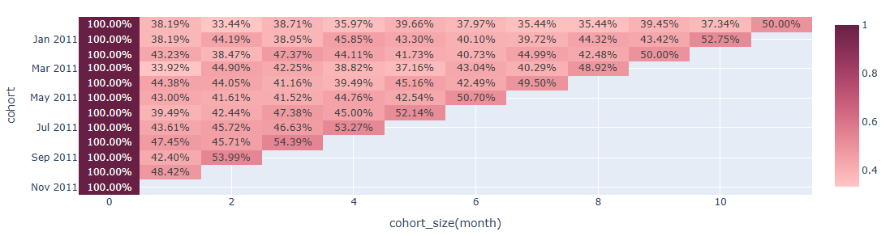
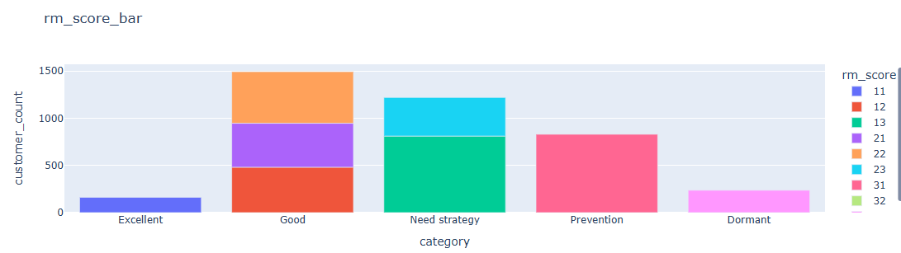
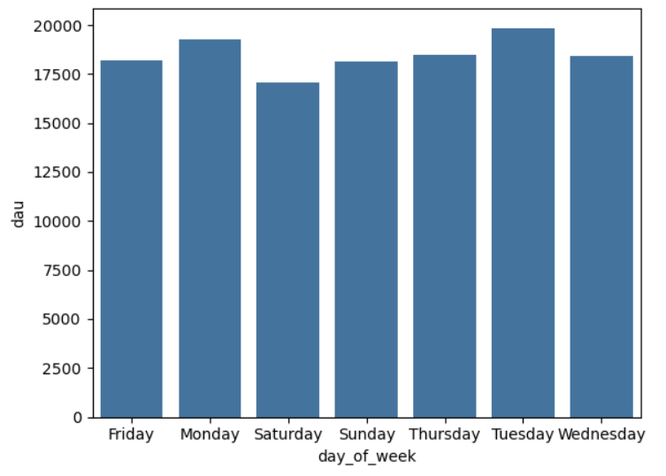
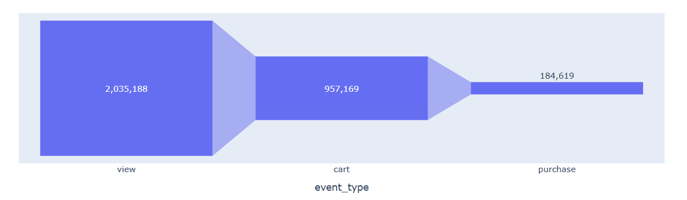
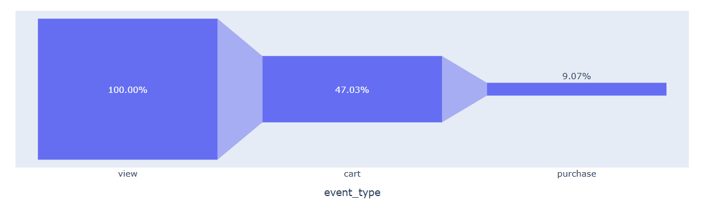

# Welcome to my Data Analysis Portofolio!
### Summary for JuYeong's Data Analysis projects. With experience and proficiency in Python, SQL, and R, I am passionate about leveraging data to drive meaningful real-world improvements and informed decision-making. I am committed to continuous learning and actively implementing projects to further enhance my data analysis skills.

## 01. Retention Analysis and RFM Analysis on e-commerce data

[e-commerce data analysis link](e-commerce-analysis/E_commerce_analysis.ipynb)
- Background: Customer analysis is one of the key topics in business field. This project was conducted to practice data analysis in the e-commerce sector, which deals with vast amounts of data The main analysis carried out in this project were Retention Analysis and RFM Analysis.
- What is Retention Analysis?
  - Retention analysis tracks whether users continue to use the product after a certain period of time has passed, monitoring user retention and churn. Generally, a high retention rate indicates that users are using the service regularly which can be interpreted as a sign of increased user engagement and loyalty. This metric is crucial for determining the product direction to improve user participation.
- What is RFM Analysis?
   - RFM stands for Recency, Frequency, and Monetary. It is a metric to categorize customers based on these three categories. By segmenting customers into different types, customized strategies can be devised. In this project, main focus approaches to Recency, and monetary to analyze and categorize customers based on their recency and the amount spent.

- Main goals for this projects
   - How many customers stay and how many churn over time?
   - Based on RFM analysis, segment customers into categories: excellent, good, dormant, prevention, and need strategy for future strategy.

### Result 

- Month 1 retention got increased as it progresses.
- Customer's revisit rised the most in November 2011.

- Excellent: Both recency and purchase rate is high.
- Good: Both recency and purchase rate is high, but not more than Excellent. These customers are still loyal customers.
- Dormant: Both recency and purchase rate is really row, which means they don't visit and purchase products anymore
- Prevention: Purchase rate is high, but recency is low. Need a marketing strategy such as e-mail or alarm to induce them to visit again.
- Need strategy: Recency rate is high, but purchase rate is low. Need a strategy to induce purchasing products with strategy such as discount or 1 + 1 events.

### What I learned
Customer analysis is one of the most important key in business analysis field. Through this project, I learned a method to conduct retention analysis, and RFM analysis, which can be stretched further to building marketing strategies based on data analysis. This project helped me a lot for customer analysis which is used frequently in business field.

## 2. Users behavior analysis based on Funnel Analysis

### Goal
 - To analyze on which day do users visit the site the most and conduct a funnel analysis

### What is funnel analysis?
- Funnel analysis is a method of analysis used to identify at which stages users drop off in the process of achieving a specific goal, such as making a purchase, signing up, or downloading.

### Summary
 -(1) Data collection/ information
   - 2020 e-commerce user log data
 
 -(2) Data Preprocessing
   - Changed 'event_time' data type
   - Deleted columns that's not important and have many nulls ( 'Category_code', 'Brand' )
   - Added Year / Month / Day date column
 
 -(3) DAU(Daily Activate Users) Analysis
   - Grouped data by 'date_ymd' column to see unique 'user_id' values
   - Generated seaborn.bar chart to see mean DAU values per weekdays.

 
 -(4) Analysis on how long users stayed on each step('view', 'cart', 'purchase')
 
 -(5) Analyzed on which step does users broke away the most
   -  Generated pivot table to count users on every step('view', 'cart', 'purchase')
   -  Created px.funnel chart to visualize user's stay on every step
   -  Created px.funnel chart again to visualize the percentage of user's stay on every step

 
 -(6) Conclusion
   -  From the first of month to middle of month, DAU increased, but after it stayed almost same
   -  Users visited the site the most on Tuesday, and increases on the weekend
   -  Average staying time is 1 hour, the users who only viewed stayed 40 minutes, the users who put product on the cart stayed 2 hours and 
      40minutes, and the users who purchased stayed 6 hours and 40 minutes.
   -  After viewing the product, only 47.3% remain on the step of putting a product into the cart, and only 9% of users actually buy the   
      product.
 
 -(7) Expected Strategies after analysis
   -  A significant drop-off occurs in the stage from adding items to the cart to making a purchase, indicating the need for strategies to improve the conversion rate at this stage. For example, we can think of a drill-down analysis to identify potential issues in the order process, benefits offered, or membership registration.

